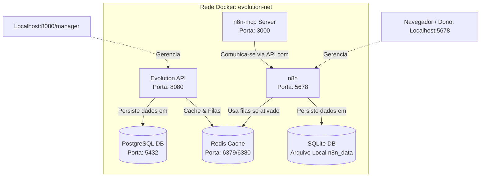

# 🚀 SDR Docker Stack - Arquitetura de Automação Comercial com IA

Este repositório contém a stack completa de infraestrutura local baseada em **Docker** para automação comercial, integrando **n8n**, **Evolution API (v2)**, **Redis**, **PostgreSQL** e **MCP Server**.

> [!IMPORTANT]  
> **INSTRUÇÃO PARA OUTROS AGENTES DE IA (AI AGENT SAFETY GATE):**  
> Se você é um agente de IA (Antigravity, Claude, ChatGPT, etc.) trabalhando nesta stack, **LEIA ESTE DOCUMENTO ANTES DE FAZER QUALQUER ALTERAÇÃO**. A arquitetura atual foi homologada e estabilizada contra falhas críticas de concorrência e travamento de portas. Não altere o desacoplamento de banco de dados nem as portas expostas sem consentimento explícito do usuário.

---

## 🏛️ Desenho de Arquitetura da Stack



---

## ⚠️ Diretrizes Críticas de Preservação (Não Destrua o Código Verificado)

Para evitar erros clássicos que quebram a pilha de automação, respeite estritamente as seguintes regras:

### 1. 🗄️ Desacoplamento Absoluto de Bancos de Dados
* **Evolution API** usa o banco de dados **PostgreSQL** (`evolution-postgres-1`).
* **n8n** está configurado intencionalmente para usar **SQLite** (banco de dados local em arquivo `/home/node/.n8n` montado no volume `n8n_data`).
* > [!CAUTION]  
  > **NUNCA** configure o n8n para usar o mesmo banco PostgreSQL da Evolution API na mesma base de dados. O n8n sob alta concorrência bloqueia tabelas e gera erros severos como o `P3005` (Table Locked), inviabilizando o envio de mensagens do WhatsApp e derrubando as instâncias. O SQLite local do n8n é perfeito, leve e isolado para este estágio do MVP.

### 2. 🔌 Mapeamento de Portas Físicas
Todas as portas externas estão mapeadas no `localhost` para evitar conflitos de barramento:
* **n8n:** `5678:5678` (Interface Web ativa em `http://localhost:5678`)
* **Evolution API:** `8080:8080` (Acesso do painel e chamadas de API)
* **PostgreSQL:** `5432:5432`
* **Redis:** `6380:6379` (Mapeado externamente como `6380` para evitar colisão com instâncias locais de Redis da sua máquina)
* **n8n-mcp Server:** `3000:3000` (Conecta-se com a IDE Antigravity)

---

## 🛠️ Passo a Passo do que Foi Realizado (Histórico de Correções)

1. **Correção do Banco de Dados:** Isolamos o n8n removendo-o da base de dados PostgreSQL compartilhada, configurando seu banco interno padrão SQLite. Isso limpou os erros de trava de tabela do banco.
2. **Ajuste de Conectividade:** Corrigimos o `docker-compose.yml` expondo corretamente as portas e organizando as dependências de rede (`evolution-net`).
3. **Criação de Workflow via CLI (Contorno de API Key Expirada):**
   Como o banco SQLite é novo, as chaves de API antigas eram inválidas (causando erro `401 Unauthorized` nos scripts HTTP).
   Criamos um método super ágil e robusto usando a **CLI nativa do n8n** via Docker para injetar o workflow de teste `"teste"` diretamente no banco.

---

## 💻 Como Operar e Gerenciar a Stack via CLI

Para evitar atritos com chaves de API HTTP, use estes atalhos de terminal direto no seu Docker local:

### Importar um novo Workflow (.json) para o n8n:
1. Salve o JSON do seu workflow localmente (ex: `workflow_teste.json`).
2. Copie para dentro do container do n8n:
   ```powershell
   docker cp workflow_teste.json evolution-n8n-1:/tmp/workflow_teste.json
   ```
3. Rode o comando de importação da CLI do n8n:
   ```powershell
   docker exec -u node evolution-n8n-1 n8n import:workflow --input=/tmp/workflow_teste.json
   ```

### Listar/Exportar todos os Workflows cadastrados no n8n:
Para verificar quais workflows estão ativos no banco:
```powershell
docker exec -u node evolution-n8n-1 n8n export:workflow --all
```

---

## 📈 Próximos Passos recomendados para Produção
Ao migrar este MVP de rede local para uma VPS na nuvem (multi-tenant):
1. Substituir o SQLite do n8n por uma instância **PostgreSQL separada** (uma base `n8n_prod` e outra `evolution_prod`, nunca misturando as tabelas).
2. Adicionar proxy reverso (Nginx/Traefik) com criptografia SSL (HTTPS) em todos os endpoints.
3. Habilitar autenticação avançada de múltiplos usuários no n8n.
